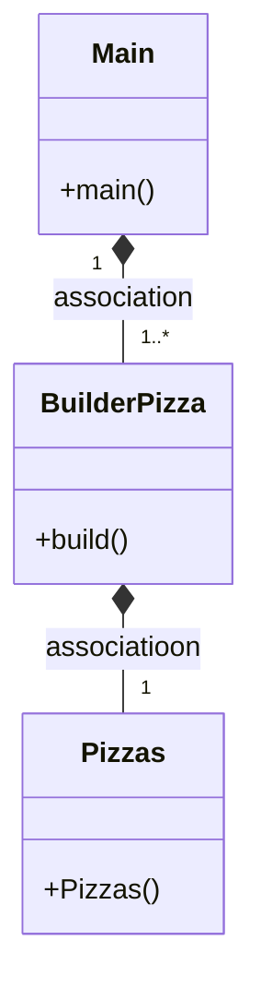
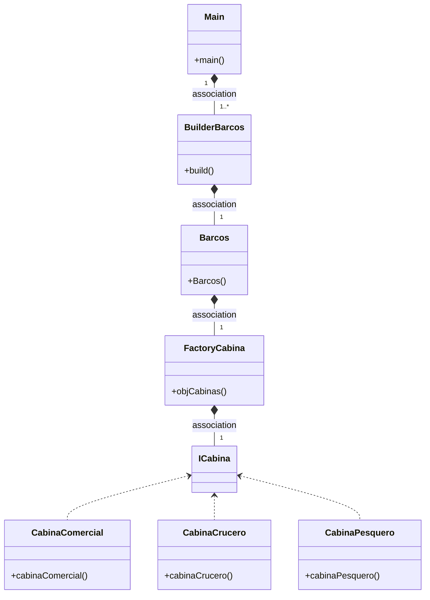

# PATRON BUILDER 

---
### ¿Que es?
El builder es un diseño que permite al constructor de una clase poder cambiar objetos complejos paso a paso. Esto te permite producir diferentes tipos y representaciones de un objeto utilizando el mismo constructor

---
### Clases
Primero tenemos la clase Pizza, esta clase tiene dos constructores, uno para ponerle valores. Y el otro por defecto con valores por defecto, este último lo usaremos con el patrón builder.
Con sus respectivos setters y getters

Despues tenemos la clase builderPizzas. Que tiene un constructor default con el constructor por defecto de Pizzas. Despues tenemos setters que devuelven BuilderPizzas. Y por último tenemos el método build(), que devuelve el objeto del constructor.

---
### ¿Se puede combinar el builder con factory?
Yo creo que si. :)

---

---
### ¿Cual es la función del patrón builder? + ¿Podríamos combinearlo con el patrón Factory? Con ejemplos
El builder nos permite tener un constructor de una clase con muchos parametros y cambiarlos paso a paso. Esto permite que ese constructor tenga un objeto, permite producir diferentes tipos y representaciones de un objeto utilizando el mismo constructor.

_Por ejemplo, si necesitamos hacer un barco:_

Para crear un barco necesitamos saber que materiales se van a usar: plástico, madera, vidrio, fibra de vidrio, aleaciones de acero, si es comercial, si es para cruceros, si es para pescar, numero de cámas, si es para cruceros numero de habitaciones, cabina...

Cabina sería una interfaz de la cual se implementa CabinaComercial, CabinaCrucero, CabinaPescadero, con un constructor con atributos como PuestosDeMandos, CamaraTrasera, PersonalRequerido. De esto tendriamos una clase llamada Factoria con un método que devolveria la interfaz Cabina, recibiendo un valor integer: si es 1 devuelve un objeto de CabinaComercial con sus atributos por defecto. Si es 2 devuelve un objeto de CabinaCrucero. Finalmente 3 devuelve CabinaPescadero. De esta manera en un solo método nos devolvería 3 diferentes tipos de objetos con sus atributos, que le podremos dar a la clase Barco.

Para hacer el builder del barco necesitaremos una clase Barco, con un constructor por defecto por ejemplo: public Barco(){plastico=true, madera=false, vidrio=false, fibraVidrio=true, aleacionAcero=true, comercial=false, crucero=true, pescadero=false, camas=1000, habitaciones=500, cabina = new CabinaCrucero()}. Y con sus respectivos setters, getters y el toString.

Después necesitaremos otra clase para el Builder. Esta clase tendría un atributo privado (private Barco _barcos) con un constructor (public Builder(){_barcos = new Barcos();}) y setters de los atributos que devolverían objeto de la clase Builder. Por último tendría un metodo que devuelve objeto tipo Barcos llamado build (retorna _barcos).

De esta manera en el main podriamos hacer un constructor: Barcos barco = new Builder() y llamar a los setters si quisieramos cambiar un atributo, *finalmente llamando al build para que returne objeto de tipo barco* por ejemplo: .setCamas(2000).build(). De esta manera tendriamos el constructor por defecto de barcos pero con 2000 camas en vez de 1000

---
### ¿Como sería el Diagrama de clases del ejemplo?

