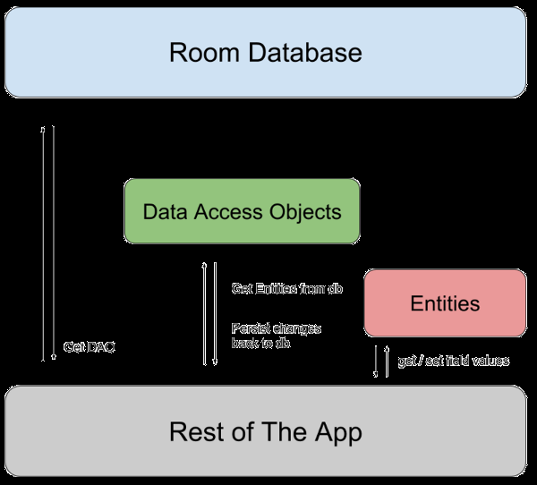

 # ROOM
 Room sirve para conservar los datos localmente. El caso de uso más común consiste en almacenar en caché datos relevantes para que el dispositivo no tenga que acceder a la red.

La biblioteca de persistencias de Room brinda una capa de abstracción para SQLite, brinda los siguientes beneficios:
- Verificación del tiempo de compilación de las consultas en SQL
- Anotaciones de conveniencia que minimizan el código estándar repetitivo y propenso a errores
- Rutas de migración de bases de datos optimizadas

(Esto hace que pueda ser mejor que usar las APIs de SQLite)

## Configuración
### Dependencias
```kotlin
plugins{
    id("kotlin-kapt")
}
...
compileOptions {
    sourceCompatibility = JavaVersion.VERSION_17
    targetCompatibility = JavaVersion.VERSION_17
}
kotlinOptions {
    jvmTarget = "17"
}
...
dependencies {
    ...
	val room_version = "2.5.1"

	implementation("androidx.room:room-ktx:$room_version")
    kapt("androidx.room:room-compiler:$room_version")
    implementation("androidx.lifecycle:lifecycle-viewmodel-compose:2.6.1")
    ...
}
```

### Componentes principales
- La clase de la base de datos que sirve como punto de acceso principal para la conexión subyacente a los datos persistentes de la app.
- (Data) Las entidades de datos que representan tablas de la base de datos de tu app.
- Los objetos de acceso a datos (DAOs) que proporcionan métodos que tu app puede usar para consultar, actualizar, insertar y borrar datos en la base de datos

La clase de *base de datos* proporciona a tu app instancias de los DAOs asociados con esa base de datos. La app puede usar los DAOs para recuperar datos de la base de datos como instancias de objetos de entidad de datos asociados. La app también puede usar las entidades de datos definidas para actualizar filas de las tablas correspondientes o crear filas nuevas para su inserción. Las relaciones entre los diferentes componentes de Room.



## Ejemplo de implementación
### (Data) Entidad de datos
Cada instancia de `User` representa una fila en una tabla `user` de la base de dato.
```kotlin
@Entity
data class User(
	@PrimaryKey val uid: Int,
	@ColumnInfo(name = "first_name") val firstName: String?,
	@ColumnInfo(name = "last_name") val lastName: String?
)
```

### (DAO) Objetos de acceso a datos
`UserDao` proporciona los métodos que el resto de la app usa para interactuar con los datos de la tabla `user`.
```kotlin
@Dao
interface UserDao {
    @Query("SELECT * FROM user")
    fun getAll(): List<User>

    @Query("SELECT * FROM user WHERE uid IN (:userIds)")
    fun loadAllByIds(userIds: IntArray): List<User>

    @Query("SELECT * FROM user WHERE first_name LIKE :first AND " +
           "last_name LIKE :last LIMIT 1")
    fun findByName(first: String, last: String): User

    @Insert
    fun insertAll(vararg users: User)

    @Delete
    fun delete(user: User)
}
```

### Base de Datos
La clase de la base de datos debe cumplir con las siguientes condiciones:
- La clase debe tener una anotación `@Database` que incluya un array (entities en este caso) que enumere todas las entidades de datos asociados con la base de datos
- Debe ser una clas abstracta que extienda `RoomDatabase`.
- Para cada clase DAO que se asoció con la base de datos, esta debe definir un método abstracto que tenga cero argumentos y muestre una instancia de la clase DAO.
```kotlin
@Database(entities = [User::class], version = 1)
abstract class AppDatabase : RoomDatabase() {
    abstract fun userDao(): UserDao
}
```

>[!NOTE]
> Si tu app se ejecuta en un solo proceso, debes seguir el patrón de diseño singleton cuando crees una instancia de un objeto AppDatabase. Cada instancia de RoomDatabase es bastante costosa y rara vez necesitas acceder a varias instancias
>Si tu app se ejecuta en varios procesos, debes incluir enableMultiInstanceInvalidation() en la invocación del creador de bases de datos.

## USO
Despues de definir la entidad de datos, el DAO y el objeto de base de datos, puedes usar el siguiente código para crear una instancia de la base de datos:
```kotlin
val db = Room.databaseBuilder(
            applicationContext,
            AppDatabase::class.java, "database-name"
        ).build()
```

Luego, puedes usar los métodos abstractos de `AppDatabase` para obtener una instancia del DAO. A su vez, puedes usar los metodos de la instancia del DAO:
```kotlin
val userDao = db.userDao()
val users: List<User> = userDao.getAll()
```

