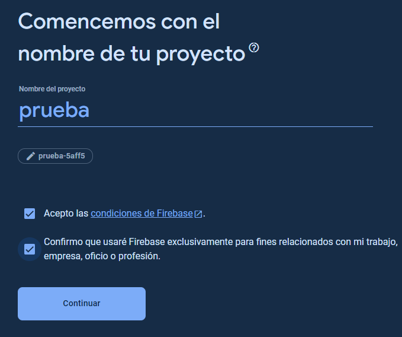
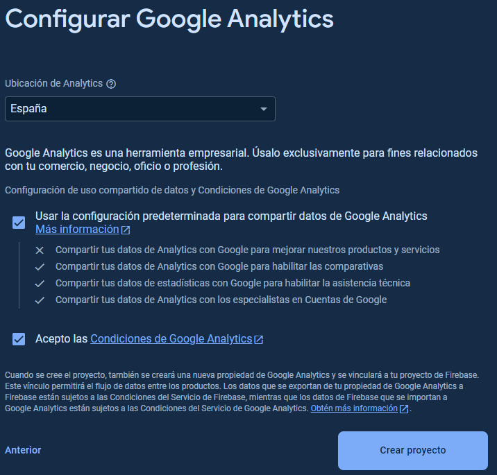

# FIREBASE
## Que es?
[Firebase](https://firebase.google.com/docs/database?hl=es****) es una base de datos alojada para desarollo de aplicaciones web y móvil en la nube que almacena y sincroniza datos en una base de datos [NoSQL](https://aws.amazon.com/es/nosql/).
Los datos se almacenan como [JSON](https://www.ibm.com/docs/es/baw/20.x?topic=formats-javascript-object-notation-json-format) y se sincronizan en tiempo real con cada cliente conectado.
Cuando se crea aplicaciones todos los clientes comparten una instancia de Realtime Database y reciben automáticamente actualizaciones con los datos más recientes.

### Capacidades clave
| Capacidad                            | Descripcion                                                                                                                                                                                                                                                                                                                                                                                                                                                                                                                 |
|--------------------------------------|-----------------------------------------------------------------------------------------------------------------------------------------------------------------------------------------------------------------------------------------------------------------------------------------------------------------------------------------------------------------------------------------------------------------------------------------------------------------------------------------------------------------------------|
| TIEMPO REAL                          | `Firebase` utiliza sincronización de datos: cada vez que los datos cambianm cualquier dispositivo conectado recibe esa actualización en milisegundos                                                                                                                                                                                                                                                                                                                                                                        |
| DESCONECTADO                         | Las aplicaciones siguen respondiendo incluso cuando están fuera de línea porque el `SDK` de `Firebase`  conserva sus datos en el disco. Cuando se restablezca la conectividad, el cliente recibe cualquier cambio que se haya perdido y lo sicroniza con el estado actual                                                                                                                                                                                                                                                   |
| ACCESIBLE DESDE DISPOSITIVOS CLIENTE | Se puede acceder directamente desde un dispositivo móvil o navegador web. La seguridad y validación de datos están disponibles a través de la base de datos en tiempo real de `Firebase`, reglas basadas en expresiones cuando se leeo escriben datos                                                                                                                                                                                                                                                                       |
| ESCALAR EN MÚLTIPLES BASES DE DATOS  | Con el plan de precios [Blaze](https://firebase.google.com/pricing?hl=es-419#blaze-calculator), puedes satisfacer las necesidades de datos de tu aplicación a escala dividiendo tus datos en múltiples instancias de base de datos en el mismo proyecto de Firebase. Optimice la autenticacion con [Firebase Authentication](https://firebase.google.com/docs/auth?hl=es) en su proyecto. Controle el acceso a los datos en cada base de datos con reglas de seguridad de Firebase personalizadas para cada instancia de DB |


## Implementación en Android
Aquí os explicaré paso a paso como implementar firebase a tu proyecto de android studio

### Crear una base de datos
Para empezar nuestro proyecto primero tendremos que [crear](https://console.firebase.google.com/project/_/database?hl=es&_gl=1*12n5qi0*_ga*MTY1MjI5MDU5OS4xNzA3MjU3NTQ0*_ga_CW55HF8NVT*MTcwNzI5MjUwNy4yLjEuMTcwNzI5NDQyOS41Ny4wLjA.) la base de datos de Firebase.
Le damos a crear un proyecto y rellenamos los campos

<details>
    <summary>Fotos paso a paso de la creación del proyecto</summary>
    <p>
        Primero tendremos que poner el nombre de nuestro proyecto y aceptar las condiciones de Firebase
        
        Despues tendremos que habilitar Google Analytics para el proyecto.
        Si hemos aceptado Google Analytics tendremos que configurar esto mismo:
        
    </p>
</details>

### Registrar la app con Firebase
Debemos registrarla app con el proyecto de Firebase. El registro de tu app a menudo se conoce como "agregar" la app a tu proyecto.
1. Dirigirse a Firebase console (deberias tenerlo abierto ya que creaste el proyecto)[pinche aqui si no es asi](https://console.firebase.google.com/?hl=es-419&_gl=1*1rvx8u4*_ga*MTY1MjI5MDU5OS4xNzA3MjU3NTQ0*_ga_CW55HF8NVT*MTcwNzI5MjUwNy4yLjEuMTcwNzI5Njc1MC4xOS4wLjA.) y escoges tu base de datos

### Agregar el sdk de Realtime Database en la aplicación (Android Studio)
En el build.gradle.kts (app) de nuestro proyecto tendremos que añadir los siguiente

```kotlin
dependecies {
    // Import the BoM for the Firebase platform
    implementation(platform("com.google.firebase:firebase-bom:32.7.1"))

    // Add the dependency for the Realtime Database library
    // When using the BoM, you don't specify versions in Firebase library dependencies
    implementation("com.google.firebase:firebase-database")
}
```
Se recomienda utilizar [Firebse Android BoM](https://firebase.google.com/docs/android/learn-more?hl=es#bom) para controlar el control de versiones de la biblioteca.

<details>
    <summary>Alternativa</summary>
<b>Tenga en centa que si usa varias bibliotecas de Firebase en su aplicacion es recomendable uar BoM</b>
    <pre>
dependencies {
    // Add the dependency for the Realtime Database library
    // When NOT using the BoM, you must specify versions in Firebase library dependencies
    implementation("com.google.firebase:firebase-database:20.3.0")
}
    </pre>
</details>