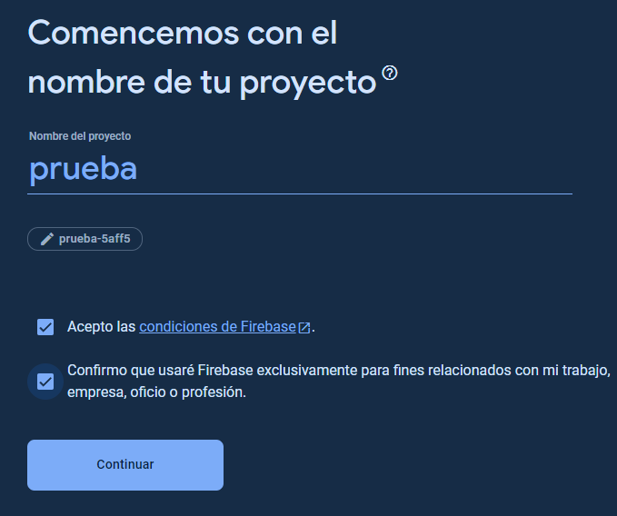
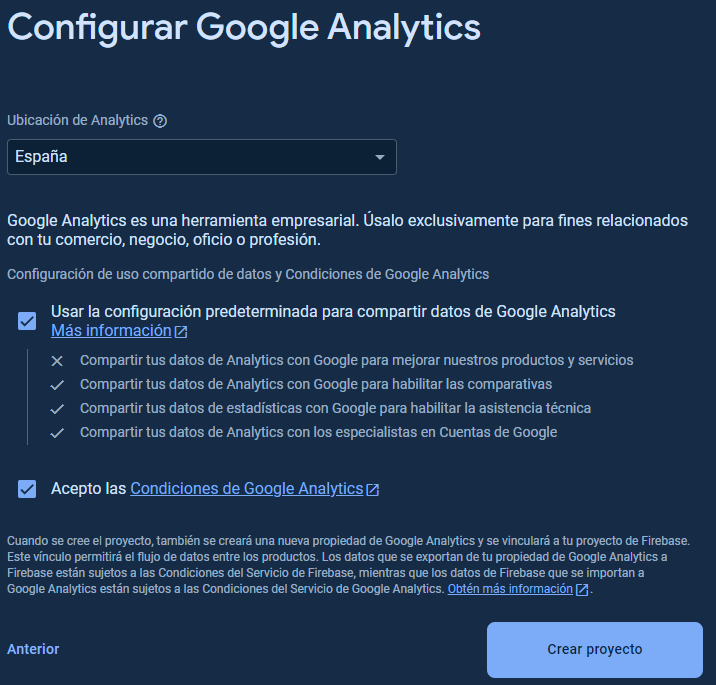
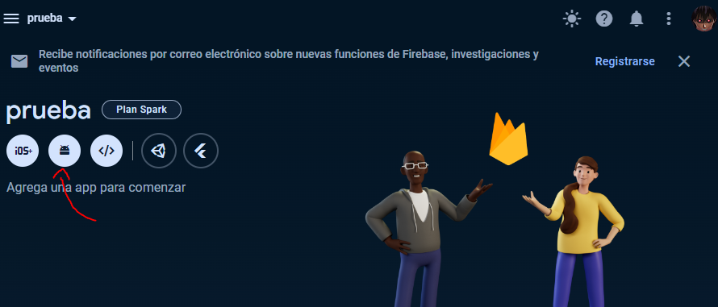
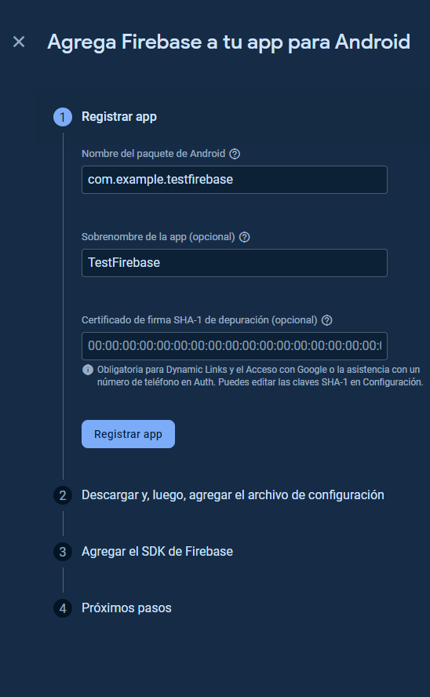
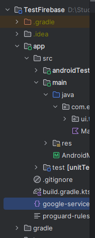

# FIREBASE
## Que es?
[Firebase](https://firebase.google.com/docs/database?hl=es****) es una base de datos alojada para desarollo de aplicaciones web y móvil en la nube que almacena y sincroniza datos en una base de datos [NoSQL](https://aws.amazon.com/es/nosql/).
Los datos se almacenan como [JSON](https://www.ibm.com/docs/es/baw/20.x?topic=formats-javascript-object-notation-json-format) y se sincronizan en tiempo real con cada cliente conectado.
Cuando se crea aplicaciones todos los clientes comparten una instancia de Realtime Database y reciben automáticamente actualizaciones con los datos más recientes.

### Capacidades clave
| Capacidad                            | Descripcion                                                                                                                                                                                                                                                                                                                                                                                                                                                                                                                 |
|--------------------------------------|-----------------------------------------------------------------------------------------------------------------------------------------------------------------------------------------------------------------------------------------------------------------------------------------------------------------------------------------------------------------------------------------------------------------------------------------------------------------------------------------------------------------------------|
| TIEMPO REAL                          | `Firebase` utiliza sincronización de datos: cada vez que los datos cambianm cualquier dispositivo conectado recibe esa actualización en milisegundos                                                                                                                                                                                                                                                                                                                                                                        |
| DESCONECTADO                         | Las aplicaciones siguen respondiendo incluso cuando están fuera de línea porque el `SDK` de `Firebase`  conserva sus datos en el disco. Cuando se restablezca la conectividad, el cliente recibe cualquier cambio que se haya perdido y lo sicroniza con el estado actual                                                                                                                                                                                                                                                   |
| ACCESIBLE DESDE DISPOSITIVOS CLIENTE | Se puede acceder directamente desde un dispositivo móvil o navegador web. La seguridad y validación de datos están disponibles a través de la base de datos en tiempo real de `Firebase`, reglas basadas en expresiones cuando se leeo escriben datos                                                                                                                                                                                                                                                                       |
| ESCALAR EN MÚLTIPLES BASES DE DATOS  | Con el plan de precios [Blaze](https://firebase.google.com/pricing?hl=es-419#blaze-calculator), puedes satisfacer las necesidades de datos de tu aplicación a escala dividiendo tus datos en múltiples instancias de base de datos en el mismo proyecto de Firebase. Optimice la autenticacion con [Firebase Authentication](https://firebase.google.com/docs/auth?hl=es) en su proyecto. Controle el acceso a los datos en cada base de datos con reglas de seguridad de Firebase personalizadas para cada instancia de DB |


## Implementación en Android
Aquí os explicaré paso a paso como implementar firebase a tu proyecto de android studio

### Crear una base de datos
Para empezar nuestro proyecto primero tendremos que [crear](https://console.firebase.google.com/project/_/database?hl=es&_gl=1*12n5qi0*_ga*MTY1MjI5MDU5OS4xNzA3MjU3NTQ0*_ga_CW55HF8NVT*MTcwNzI5MjUwNy4yLjEuMTcwNzI5NDQyOS41Ny4wLjA.) la base de datos de Firebase.
Le damos a crear un proyecto y rellenamos los campos

<details>
    <summary>Fotos paso a paso de la creación del proyecto</summary>
    <p>
        Primero tendremos que poner el nombre de nuestro proyecto y aceptar las condiciones de Firebase
        
        Despues tendremos que habilitar Google Analytics para el proyecto.
        Si hemos aceptado Google Analytics tendremos que configurar esto mismo:
        
    </p>
</details>

### Registrar la app con Firebase
Debemos registrarla app con el proyecto de Firebase. El registro de tu app a menudo se conoce como "agregar" la app a tu proyecto.
1. Dirigirse a Firebase console (deberias tenerlo abierto ya que creaste el proyecto)[pinche aqui si no es asi](https://console.firebase.google.com/?hl=es-419&_gl=1*1rvx8u4*_ga*MTY1MjI5MDU5OS4xNzA3MjU3NTQ0*_ga_CW55HF8NVT*MTcwNzI5MjUwNy4yLjEuMTcwNzI5Njc1MC4xOS4wLjA.) y escoges tu base de datos
2. Haz clic en el icono de Android para iniciar el flujo de trabajo de configuración.
3. Ingresamos el nombre del paquete de tu app en el campo Nombre del paquete de Android
4. Descargamos el archivo json y lo guardamos en la carpeta app de nuestro proyecto


5. Agregamos el [SDK](#agregar-el-sdk-de-realtime-database-en-la-aplicación-android-studio)

### Agregar el sdk de Realtime Database en la aplicación (Android Studio)
Para que los SDKs de Firebase puedan acceder a los valores de nuestro archivo de configuracion `google-services.json` necesitamos agragar lo siguiente:
Agregar el complemento de `Google Services` como dependecia. En el build.gradle.kts (proyecto) de nuestro proyecto añadiremos el siguiente plugin:
```kotlin
plugins {
  // ...

  // Add the dependency for the Google services Gradle plugin
  id("com.google.gms.google-services") version "4.4.0" apply false

}
```

Agregar el complemento de los servicios de Google en el archivo de Gradle de app. En el build.gradle.kts (app) de nuestro proyecto tendremos que añadir un plugin:
```kotlin
plugins {
    ...
  
    // Add the Google services Gradle plugin
    id("com.google.gms.google-services")
}
```

#### Agregar los SDK de Firebase a tu app
En el archivo de Gradle (app) tendremos que agregar las dependencias de los [productos de Firebase](https://firebase.google.com/docs/android/setup?hl=es-419#available-libraries) que quieras usar en tu app. Es recomendado usar la [BoM de Firebase para Android](https://firebase.google.com/docs/android/learn-more?hl=es-419#bom)

En el build.gradle.kts (app) de nuestro proyecto tendremos que añadir un plugin mas las dependencias:
```kotlin
dependencies {
  ...

  // Import the Firebase BoM
  implementation(platform("com.google.firebase:firebase-bom:32.3.1"))

  // When using the BoM, you don't specify versions in Firebase library dependencies

  // Add the dependency for the Firebase SDK for Google Analytics
  implementation("com.google.firebase:firebase-analytics-ktx")

  // TODO: Add the dependencies for any other Firebase products you want to use
  // See https://firebase.google.com/docs/android/setup#available-libraries
  // For example, add the dependencies for Firebase Authentication and Cloud Firestore
  implementation("com.google.firebase:firebase-auth-ktx")
  implementation("com.google.firebase:firebase-firestore-ktx")
}

```
Ahora sincronizaremos el proyecto de Android y ya podremos usarlo.

### Google Analytics
Sirve para obtener estadísticas sobre el comportamiento de los usuarios con [Analytics] 