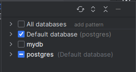

# ODOO

## Indice
1. [Que es Odoo y que necesitamos para usarlo?](#que-es-odoo-y-que-necesitamos-para-usarlo)

2. [Docker compose](#docker-compose)
   - [Odoo](#odoo)
   - [Postgres](#postgres-docker)
     - [Como vemos que la base de datos esta funcionando desde un IDE?](#como-vemos-la-base-de-datos-desde-ide)
     - [Que hacer si el puerto no esta disponible?](#que-hacer-puerto-no-disponible)
   - [Lanzar el docker compose](#lanzar-docker-compose)

3. [Como ver que el Odoo esta funcionando?](#como-ver-que-odoo-esta-funcionando)
   - [Como vemos que la nueva base de datos se ha creado?](#como-vemos-nueva-base-de-datos-creada)

4. [Que funcionalidades podremos realizar con Python?](#funcionalidades-con-python)
   - [Desarrollo de Módulos](#desarrollo-de-modulos)
   - [Framework Odoo](#framework-odoo)
   - [Object-Relational Mapping (ORM)](#orm)
   - [Personalización y Scripts](#personalizacion-y-scripts)

## Que es Odoo y que necesitamos para usarlo?
Odoo es un *ERP* (Planificacion de Recursos Empresariales) de codigo abierto, que nos permite gestionar una empresa de forma integral, desde la gestion de clientes, proveedores, facturacion, contabilidad, etc.
Para usar odoo necesitamos precisa de tener instalado:
- `Una base de datos`(En este caso usaremos *Postgres*)
- `Python` (odoo esta escrito en python y lo necesitaremos para poder hacer algunas [funcionalidades](#python))

## Docker compose
### Odoo
```yml
version: '3.1'

services:
  # odoo:
  web: # name of the service
    image: odoo:16.0 # image to use
    depends_on: # odoo dependes on postgres
      - mydb # container name of the postgres service
    ports:
      - "8069:8069"
    environment: # configuration of the odoo
      - HOST=mydb # same name as the postgres service
      - USER=odoo # user of the postgres
      - PASSWORD=odoo # password of the postgres user
```

### Postgres
Necesitamos una base de datos para poder usar odoo, por lo que en este caso usaremos postgres y crearemos otro contenedor para ello.<br>
:warning: Ten cuidado de no tener el [puerto](#puerto) de postgres ocupado.
```yml
  # postgres:
  mydb: # name of the service
    image: postgres # image to use
    ports:
      - "5432:5432"
    environment: # configuration of the postgres
      POSTGRES_DB: postgres # name of the database
      POSTGRES_PASSWORD: odoo # password of the user
      POSTGRES_USER: odoo # user of the postgres
```

#### Como vemos que la base de datos esta funcionando desde un IDE?
En caso de que estés usando pycharm como yo, en la pestaña de la derecha le damos al boton de `Database` y nos aparecera una ventana donde podemos ver las bases de datos que tenemos.
Al no tener ninguna le daremos al + , despues a `Add a Database` y nos aparecera una ventana donde pondremos elegir el servicio, en este caso usaremos la de postgres, nos aparecera otra ventana donde tendremos que poner el nombre de la base de datos, el usuario y la contraseña.
En esta ventana puede que te salga que tienes que descargar un driver, si es así hazlo. Cuando tengas eso configurado y descargado el Driver pulsa en `Test Connection` si te dice que la conexion es correcta pulsa en `Apply` y despues en `OK`. Ahora donde no teniamos ninguna base de datos ya deberiamos tener la que acabamos de crear.
<details><summary><b><i>IMAGENES</i></b></summary>
<p>


</p>
</details>

#### Que hacer si el puerto no esta disponible?
<a id="puerto"> </a>
Si el puerto no esta disponible tendremos que usar el siguiente comando en la terminal para ver quien lo está usando:

```bash
sudo netstat -putan | grep 5432
```
Y si nos sale un proceso que lo esta usando tendremos que matarlo con el siguiente comando:
```bash
sudo kill nombre_del_proceso
```

En mi caso no he tenido que matar ningun proceso ya que no estaba ocupado antes de hacer el docker compose.


#### Lanzar el docker compose
Para subirlo tendremos que usar el comando `docker-compose up -d`, si en el siguiente paso no ves la página tendrás que ejecutar el comando `docker compose down -v` y volver a subirlo.

## Como ver que el odoo esta funcionando?
Para ver el odoo tendremos que ir a la url `localhost:8069` y nos aparecera la pagina de inicio de sesion de odoo. Cuando lo hayas configurado ya tendrás disponible el odoo. <u>Ejemplo:</u>


> [!WARNING]
> En el apartado Database Name tendras que poner otro nombre que no sea el de la base de datos de postgres del docker compose, ya que si no te dara un error.


### Como vemos que la nueva base de datos se ha creado?
En el mismo IDE que ante y igual que en un paso anterior, a la derecha le damos al boton de `Database` y nos aparecera una ventana donde podemos ver las bases de datos que tenemos. Al lado del nombre del servicio de postgres nos aparecera un numero, si ese es uno le tendremos que dar a refrescar:<br>

<br> Ahora ya debería salir una etiqueta que hay 1 de 2, le daremos click a esa misma y marcaremos la base de datos que hemos puesto en la configuración de odoo del paso anterior, tambien podrías desmarcar las otras ya que no las necesitarás. De esta forma ya sabemos que se ha creado de forma correcta.
<br>


## Que funcionalidades podremos realizar con python? 
<a id="python"> </a>

* **Desarrollo de Módulos:**
  - En Odoo, los diferentes componentes y funcionalidades se organizan en módulos escritos en Python.
  - Tanto el desarrollo de nuevos módulos como la personalización de los existentes se lleva a cabo mediante scripts Python.

* **Framework Odoo:**
  - Python desempeña un papel esencial en el framework interno de Odoo.
  - Proporciona las herramientas necesarias para la gestión de la interfaz de usuario, la lógica empresarial y la seguridad.

* **Object-Relational Mapping (ORM):**
  - Odoo utiliza un ORM en Python para interactuar con la base de datos.
  - Este ORM simplifica la manipulación de datos y la creación de modelos de datos, facilitando a los desarrolladores trabajar con la base de datos de manera eficiente.

* **Personalización y Scripts:**
  - Los usuarios de Odoo suelen realizar personalizaciones y desarrollos adicionales a través de scripts Python.
  - Python es esencial para la creación de nuevas funcionalidades y la adaptación del sistema según las necesidades específicas de la empresa.