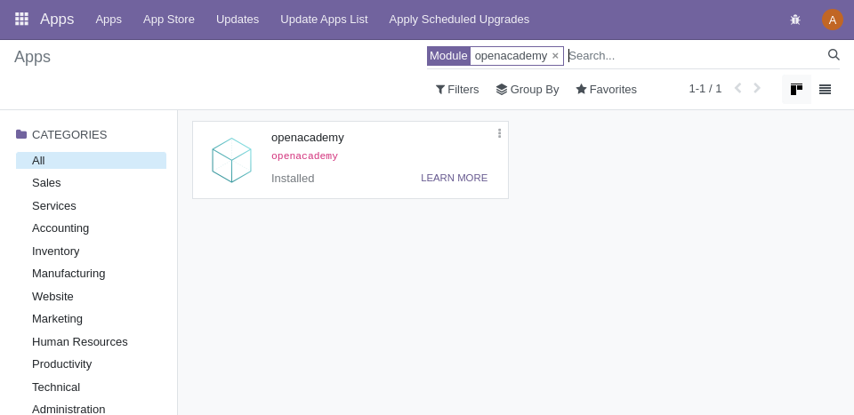
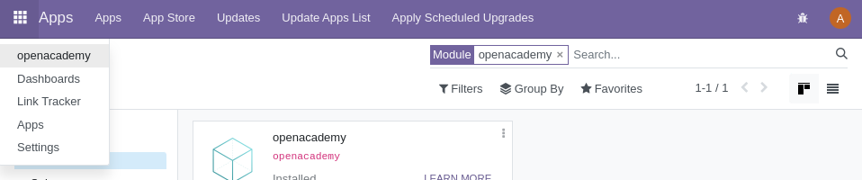
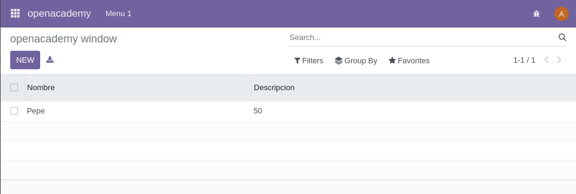
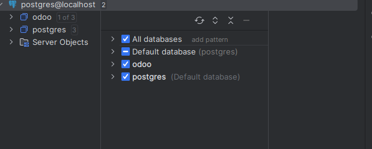
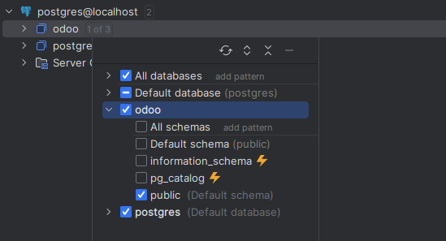
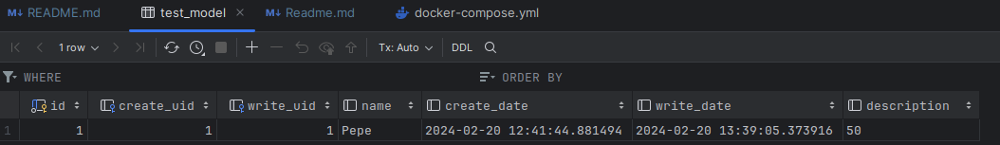

# Como crear addons en odoo

## Crear un modulo
Para crear un modulo primero crearemos una carpeta, en este caso la llamamos `extra-addons`. 
Y la vinculamos en el docker compose con el volumen `extra-addons:/mnt/extra-addons`.
```yaml
services:
  # odoo:
  web_dev:
    image: odoo:16.0
    depends_on:
      - mydb_dev
    volumes:
      - ./extra-addons:/mnt/extra-addons
    ports:
      - "8069:8069"
    environment:
      - HOST=mydb_dev # same name as the postgres service
      - USER=odoo
      - PASSWORD=odoo
```
Ahora tendremos que entrar en la terminal

```bash
docker exec -u root -it nombre_contenedor_odoo-1 /bin/bash;
```
Ahora que estamos dentro del contenedor de odoo, vamos a la carpeta de addons
```bash
cd /mnt/extra-addons/
```
En el siguiente paso crearemos un modulo, para ello usaremos el comando `odoo scaffold` seguido del nombre del modulo que queremos crear, en este caso openacademy.
```bash
odoo scaffold openacademy/
```
Y para poder modificar el modulo, tendremos que cambiar los permisos de la carpeta del modulo.
```bash
chown -R 777 openacademy/
```

### Modificar el modulo
Una vez creado el modulo lo primero que haremos será cambiar el nombre, la descripcion, el resumen del modulo en el archivo `__manifest__.py`
```python
'name': "openacademy",

'summary': """Este es un modulo de odoo que guarda nombres y descripciones de cosas.""",

'description': """Este es mi modulo de odoo""",

'author': "NSteuerberg",
'website': "https://www.nsteuerberg_openacademy.com",
```
tambien podriamos cambiar la version del modulo, esta la cambiaremos todo el rato que  cambiemos algo para poder asegurarnos de que se haya subido correctamente.
```python
'version': '0.1',
```

### Crear un modelo o tabla
Nos dirigimos a la carpeta `models` y podemos cambiarle el nombre al archivo `openacademy.py`. 
Ahora que hicimos eso nos toca modificar el archivo, en este caso con cambiar la clase TestModel nos sirve:
```python
class TestModel(models.Model):
    _name = 'test_model' # Nombre de la tabla
    _description = 'Test Model' # Descripcion de la tabla

    name = fields.Char(string='Name', required=True) # nombre del campo (name) y que tipo es + si es requerido
    description = fields.Text() # nombre del campo (descripcion) y que tipo es
```
En este caso estamos creando una tabla llamada `test_model` con dos campos, uno llamado `name` y otro llamado `description`.

### Crear una vista
En este paso nos moveremos a la carpeta views y modificaremos el archivo `views.xml`. Y tendremos que descomentar los apartados de debajo de los siguiente puntos:
<details><summary><b>explicit list view definition</b></summary>

    <record model="ir.ui.view" id="openacademy.list">
      <field name="name">openacademy list</field>
      <field name="model">test_model</field> 
      <field name="arch" type="xml">
        <tree>
          <field name="name"/>
          <field name="description"/>
        </tree>
      </field>
    </record>
Cambiando en el apartado `<field name="model">` por el nombre de la tabla que hemos creado, en este caso `test_model`.

Y en el apartado `<tree>` poniendo los campos de nuestra tabla
</details>

<details><summary><b>actions opening views on models</b></summary>

    <record model="ir.actions.act_window" id="openacademy.action_window">
      <field name="name">openacademy window</field>
      <field name="res_model">test_model</field>
      <field name="view_mode">tree,form</field>
    </record>

Cambiando en el apartado `<field name="res_model">` por el nombre de nuestra tabla, en este caso `test_model`.
</details>

<details><summary><b>Top menu item</b></summary>
Descomentamos el top menu item, menu categories y 1 action 

    <menuitem name="openacademy" id="openacademy.menu_root"/>

    <!-- menu categories -->
    <menuitem name="Menu 1" id="openacademy.menu_1" parent="openacademy.menu_root"/>
    <menuitem name="Menu 2" id="openacademy.menu_2" parent="openacademy.menu_root"/>

    <!-- actions -->
    <menuitem name="List" id="openacademy.menu_1_list" parent="openacademy.menu_1"
              action="openacademy.action_window"/>

Y en este apartado no hace falta cambiar nada.
</details>

### Cambiar el acceso a la vista
Para poder ver nuestra vista tenemos que cambiar el acceso a la vista, 
para ello nos dirigimos a la carpeta `security` y modificamos el archivo `ir.model.access.csv`.
Tenemos que cambiar la linea 2, en este caso la cambiamos a:
```csv
access_openacademy_openacademy,openacademy.openacademy,model_test_model,base.group_user,1,1,1,1
```
Tenemos que cambiar el `model_openacademy.openacademy` por el nombre de nuestra tabla, en este caso `model_test_model`.

Y por ultimo tendremos que ir al archivo `__manifest__.py` y descomentar la siguiente linea:
```python
'data': [
    'security/ir.model.access.csv', # linea a descomentar
],
```

### Instalar el modulo
Ahora que tenemos todo esto cambiaremos la version en `__manifest__.py` y lo subiremos a odoo.
```shell
docker compose up -d
docker compose restart
```
(dependiendo si ya lo tenias lanzado o no)

Nos dirigimos al apartado apps, borramos el filtrado Apps y buscamos openacademy (en mi caso)


Y updateamos el modulo. Ahora si vamos a los 9 puntos de arriba a la izquierda nos deberia salir nuestro modulo `openacademy`.
Si le damos click nos deberia llevar a la vista con nuestra tabla.:





Desde esta vista podremos modificar los campos de la tabla, añadir nuevos campos, borrar campos, etc.

### Ver la base de datos desde un IDE
En caso de que no hayas puesto anteriormente la base de datos en el IDE, tendras que hacerlo ahora.:
<details><summary><b><i>METER BASE DE DATOS IDE</i></b></summary>
<p>
En caso de que estés usando pycharm como yo, en la pestaña de la derecha le damos al boton de `Database` y nos aparecera una ventana donde podemos ver las bases de datos que tenemos.
Al no tener ninguna le daremos al + , despues a `Add a Database` y nos aparecera una ventana donde pondremos elegir el servicio, en este caso usaremos la de postgres, nos aparecera otra ventana donde tendremos que poner el nombre de la base de datos, el usuario y la contraseña.
En esta ventana puede que te salga que tienes que descargar un driver, si es así hazlo. Cuando tengas eso configurado y descargado el Driver pulsa en `Test Connection` si te dice que la conexion es correcta pulsa en `Apply` y despues en `OK`. Ahora donde no teniamos ninguna base de datos ya deberiamos tener la que acabamos de crear.




</p>
</details>
Si ya tenemos esto añadiremos la bases de datos que podemos mirar la base de datos en la que guardamos la tabla:


Ahora modificaremos los esquemas que queremos ver, en este caso solo nos hace falta `public`:



Ahora abriremos public, tables y buscamos nuestra tabla y le damos doble click para poder entrar a ver los campos de la tabla:



---
Gracias por su atencion, con cariño Nicolás Rodríguez sSteuerberg.