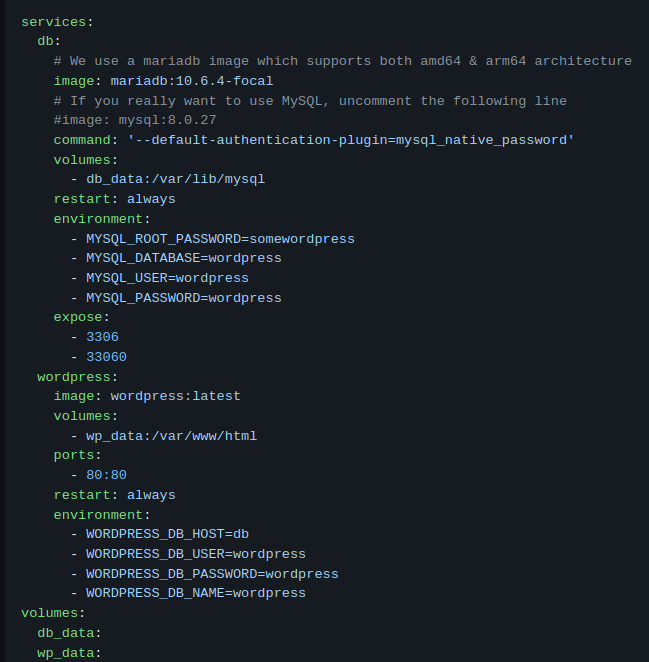
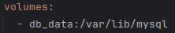
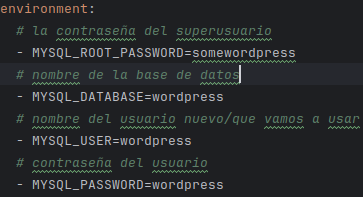
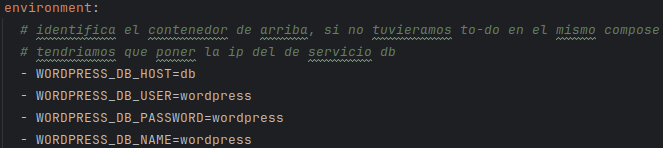
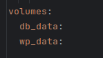
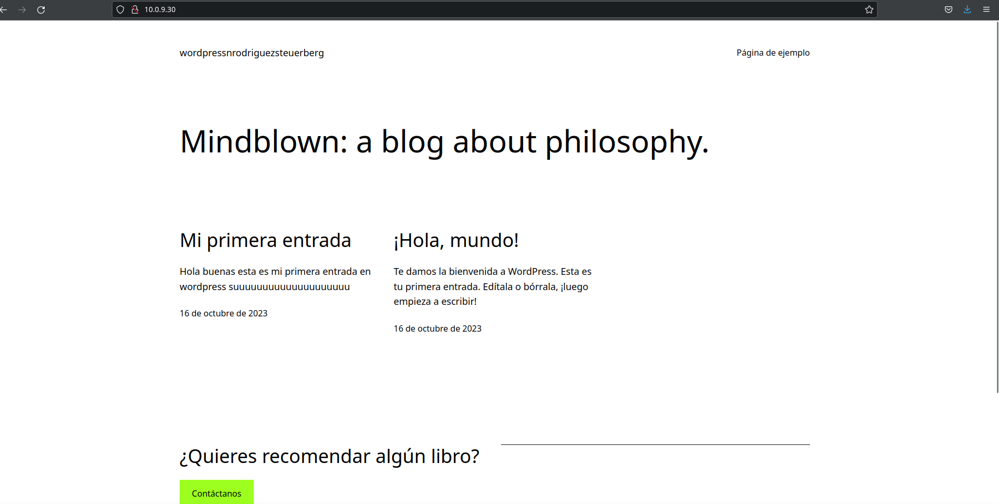

# Wordpress

1. Lo primero que tenemos que hacer es buscar informacion sobre wordpress
2. Lo segundo es buscar la imagen  en [docker hub](https://hub.docker.com/_/wordpress) o en [docker docs](https://docs.docker.com/samples/mariadb/). En este caso usamos este último, ahí simplemente tendremos que entrar en el enlace _Compose and Wordpress_ que nos enviará a un  [repositorio de github](https://github.com/docker/awesome-compose/tree/master/official-documentation-samples/wordpress/)
3. Desde ahí podremos ver como es el docker-compose
 
   

   y ahora explicaré que es cada cosa empezando por el servicio de mariadb(db)
    
    + **db:** es un servicio con nombre de servidor db
      + **image:** es la imagen del contenedor que podremos encontrar en [docker hub](https://hub.docker.com/_/wordpress)
      `image: mariadb:10.6.4-focal`
      + **command:** para realizar un comando, en este caso para indicar el plugin de mysql: 
      `command: '--default-authentication-plugin=mysql_native_password'`
      + **volumes:**  sirve cambiar el volumen para no usar los datos de la carpeta predeterminada
      
      + **environment:** sirve para expecificar la configuracion de la base de datos:
      
      + **expose:** esto está para que los contenedores puedan acceder a este a traves de esos puertos
    + **wordpress:** es otro servicio, que tiene de nombre de servidor wordpress. Y como tiene cosas parecidas al anterior os pondré enlaces a la explicación anterior
        + [image:](#enlaceImage)
        + **ports:** nos permite mapear los puertos del contenedor -> antes de los dos puntos es el puerto de la maquina y el de despues es el del contenedor
        + [environment:](#enlaceEnvironment)
         
    + Al finalizar las declaraciones de los servicios tendremos que declarar los volumnes que usamos otra vez:
      

4. Ahora que tenemos el docker compose creado tendremos que lanzarlo: `docker compose up -d`
5. Ahora que ya lo tenemos encendido solo tendremos que acceder a el a traves de nuestro navegador poniendo: `localhost` o en vez de poner localhost nuestra ip y se verá algo así:
   

Entrar en postgres psql -h localhost -U postgres