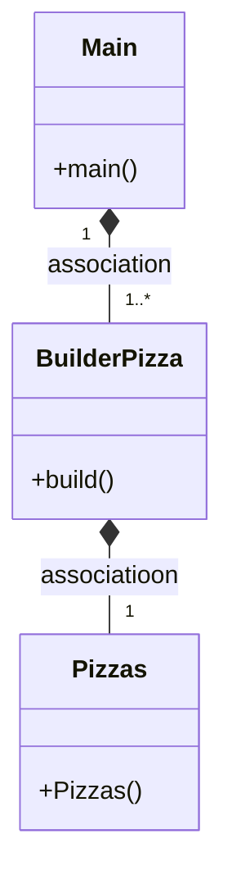

# PATRON BUILDER 

---
### ¿Que es?
El builder es un diseño que permite al constroctor de una clase poder cambiar objetos complejos paso a paso. Esto te permite producir diferentes tipos y representaciones de un objeto utilizando el mismo constructor

---
### Clases
Primero tenemos la clase Pizza, esta clase tiene dos constructores, uno para ponerle valores. Y el otro por defecto con valores por defecto, este último lo usaremos con el patrón builder.
Con sus respectivos setters y getters

Despues tenemos la clase builderPizzas. Que tiene un constructor default con el constructor por defecto de Pizzas. Despues tenemos setters que devuelven BuilderPizzas. Y por último tenemos el método build(), que devuelve el objeto del constructor.

---
### ¿Se puede combinar el builder con factory?
Yo creo que si. :)

---

